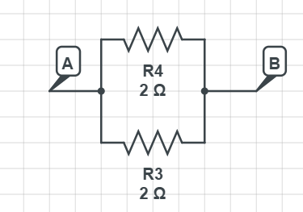
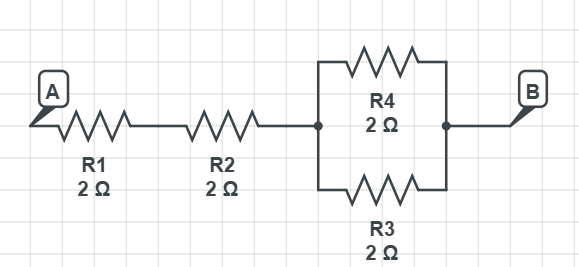
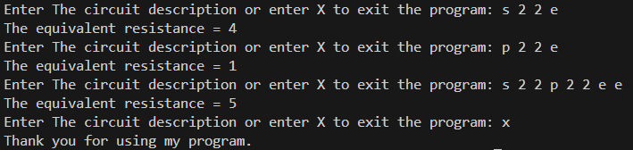

# ⚡ Circuit Analyzer  

A solo coding project built for college — it analyzes resistor circuits described in text form and computes their **equivalent resistance** with utmost efficiency by recursively breaking down **series** and **parallel** connections.  

---

## 🧩 Circuit Description Format (Input)

### 🔹 1. Series Connection  
**Example:**  
s 2 2 e

yaml
Copy code

This describes a circuit that looks like this:  
 

  

**Equivalent Resistance:** `4 Ω`

---

### 🔸 2. Parallel Connection  
**Example:**  
p 2 2 e

yaml
Copy code

This describes a circuit that looks like this:  
 

  

**Equivalent Resistance:** `1 Ω`

---

### 🔹 3. Combined Series and Parallel  
**Example:**  
s22p22ee

yaml
Copy code

This represents a more complex circuit combining both types of connections:  
 

  

**Equivalent Resistance:** `5 Ω`

---

## 💻 Example Outputs  

Here’s the output of the program for all the previous examples:  
 

  

Try it yourself — the program supports **countless circuit combinations!**

---

## 🧠 Key Concepts
- Recursive parsing and breakdown of circuit descriptions  
- Efficient computation of equivalent resistance  
- Supports both **series** and **parallel** resistor networks  

---

## 🧰 Technologies Used

  
 
**Language:** C++  
**IDE:** Visual Studio Code *(or any IDE you prefer)*  

---

## 📬 Contact  

📧 [mahmoud.ehab.moheb.dev@gmail.com](mailto:mahmoud.ehab.moheb.dev@gmail.com)

